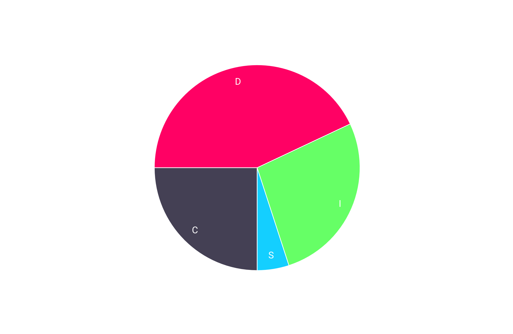

---
# Feel free to add content and custom Front Matter to this file.
# To modify the layout, see https://jekyllrb.com/docs/themes/#overriding-theme-defaults

layout: home
---

Enthusiastic and organised student recently relocated to Sydney, with hands-on experience in
customer service and hospitality. Skilled at maintaining composure and resolving conflicts with
challenging customers, as well as thriving under pressure in fast-paced environments. Seeking a part-
time or casual role with hours that can fit around study commitments (ideally weekends) to further
develop my skills while contributing to a dynamic team.

    
Education

        

            
<b>Bachelor of Arts</b> | <i>University of Notre Dame</i> | Beginning Feb 2025

            
<b>Undergraduate Certificate in Science (Transferred)</b> | <i>University of Tasmania</i> | Jul 2024–Dec 2024
            <ul>    
                <li>Student representative</li>
                <li>7.0 GPA</li>
            </ul>

            
<b>Various Single Subjects</b> | <i>Open Universities Australia</i> | Aug 2020–Dec 2023
            <ul>
                <li>100% mark in Foundations of Mathematics (Murdoch University, 2020)</li>
            </ul>

            
<b>Years 7-11</b> | <i>Nepean Creative and Performing Arts High School</i> | 2019–Aug 2020
            <ul>
                <li>Head of Year (yr. 7, 2019)</li>
                <li>ICAS Science High Distinction (2019)</li>
                <li>APSMO Mathematical Olympiad Highest Individual Score (2019)</li>
            </ul>

        

    
Work History

        

            
<b>Food & Beverage Team Member (Front of House)</b> | <i>Scenic World</i> | Jun 2024–Jan 2025
            <ul>
                <li>Provided exceptional customer service in a fast-paced environment, handling high-pressure situations and effectively resolving customer concerns</li>
                <li>Operated Point of Sale systems (in both café and restaurant settings), processing transactions accurately and efficiently</li>
                <li>Collaborated with tour guides and group leaders to ensure an outstanding guest experience</li>
                <li>Performed various tasks for corporate events, weddings, and other functions, including setup and waitstaff duties</li>
            </ul>

            
<b>Academic Tutor</b> | <i>Just Think About It Education</i> | Feb 2023–Jun 2024
            <ul>
                <li>1-1 Maths, English, and Science tuition up to Year 12</li>
            </ul>

        

    
Accomplishments

        

        

    
Certifications

        

            <ul>
                <li>RSA</li>
                <li>Food Handler Basics Certificate</li>
            </ul>
        

    
Skills

        

            <h3>Hard Skills</h3>
            <ul>
                <li>Piano (Grade 8)</li>
                <li>Violin (Grade 5)</li>
                <li>Microsoft Office Suite</li>
            </ul>
            <h3>Soft Skills</h3>
            <ul>
                <li>Resilience</li>
            </ul>
        

    
Personality Assessments

        

        

            
Myers–Briggs Type Indicator: ENTJ-A

                
        

        

            
Big Five

        

        

            
DISC Assessment

                
        

        

    
Cognitive Assessments

        

            

                
Work in progress

            

        

